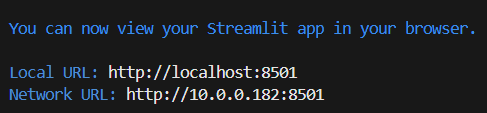

# Streamlit dashboard analyzing motor vehicle collisions in NYC

## INSTRUCTION 

Run `streamlit run app.py`  to execute the code in this file, and you will see a Streamlit app with an interactive widget 

Go to either URL to see the result

If you want to modify the code , please follow these steps:
    
- change code in the app.py

- Click Rerun if you are running the app.py and see the result 
